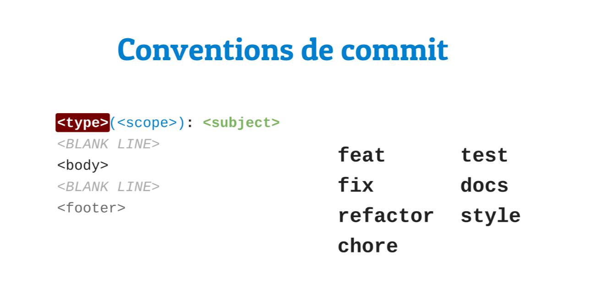

# Convention de commit

## TL;DR



## Format

Les messages de commits sont rédigés en anglais.

```
<type>(<scope>): <subject>
<BLANK LINE>
<body>
<BLANK LINE>
<footer>
```

Le header (la première ligne, composée de `<type>`, `<scope>`, et `<subject>`) est obligatoire.
Dans le header seul le scope est facultatif.


* `<type>`, valeurs possibles :
    * **feat** : nouvelle fonctionnalité
    * **fix** : correction de fonctionnalité
    * **refactor** : changements de code qui n'apportent ni corrections ni nouvelles fonctionnalités
    * **style** : changements cosmétiques du code (CS, white-spaces, formattage, etc.)
    * **test** : ajout, modification ou correction de tests
    * **chore** : changements qui ne concerne pas directement le code (ex : configuration de déploiement, outils auxiliaires)
    * **docs** : ajout, modification ou correction de la documentation
* `<scope>` : définit la partie du code modifiée, (ex: search, user profile, etc.)
* `<subject>` : description courte des changements apportés par le commit
* `<body>` : description détaillée, peut inclure les raison de choix effectué
* `<footer>` : références, par exemple vers les issues concernés

## Références

* Git++ : Passez au niveau supérieur de la gestion de version
    * [la conférence](https://www.youtube.com/watch?v=m0_C2cfM9IM)
    * [les slides](http://webadeo.github.io/git-simpler-better-faster-stronger/#23.0)
* [Convention de commit angular](https://github.com/angular/angular.js/blob/master/CONTRIBUTING.md#-git-commit-guidelines)
